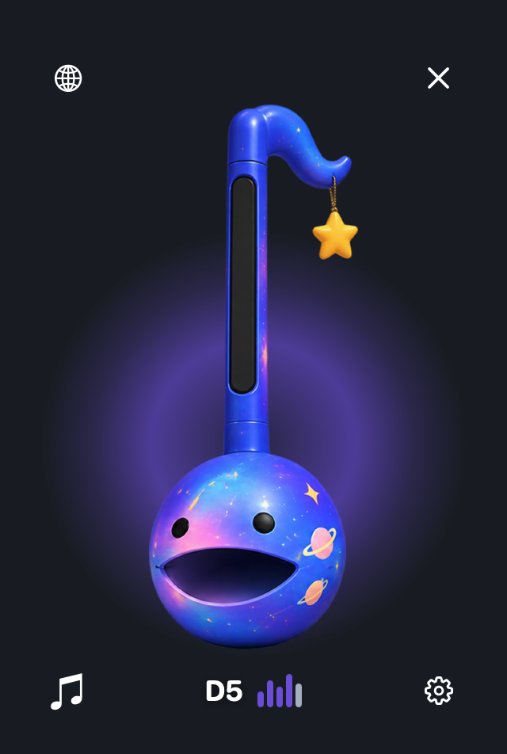
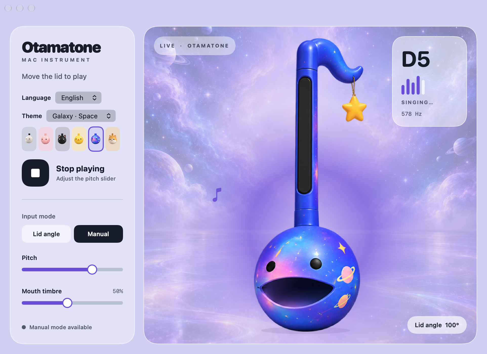

# Mactamatone

English / [한국어](README_KO.md)

<p align="center">
  
</p>

Play an Otamatone by tilting your MacBook display. A floating instrument follows your screen angle with three octaves of sound, animated mouth positions, and six themes.

## Install

Requires an Apple Silicon Mac running macOS 14 or later.

```sh
brew install --cask yurseria/tap/mactamatone
```

You can also download a DMG from [Releases](https://github.com/yurseria/mactamatone/releases). For source builds and installation details, see the [development guide](docs/DEVELOPMENT.md).

## Widget

<p align="center">
  
</p>

- Press **♫** to turn sound on or off. A diagonal slash means sound is off.
- Move the display to change pitch continuously from **C3 to C6 over 25°–130°**. Sound stops below 25°.
- The mouth and five bars follow the pitch. During playback, a theme-colored halo grows and shrinks every two seconds.
- Drag the instrument to move the widget. Use the globe to change language, the gear to open settings, and **X** to quit.

The widget stays available when you close settings. On macOS 26 and later, its background uses Liquid Glass.

## Settings

<p align="center">
  
</p>

- Choose **Classic, Pink, Black Cat, Yellow Chick, Galaxy, or Shiba Inu**. Each theme has its own scene and playback halo.
- Switch between **lid-angle input** and **manual play**. Manual play is also available when the lid sensor is unavailable.
- Adjust **Mouth timbre** to change the character of the sound.
- Choose **English** or **한국어**. English is the default; your language and theme are saved for the next launch.

The screenshots show the Galaxy theme in manual play. Enable macOS **Reduce Motion** to keep the halo still.

## Documentation

- [Development](docs/DEVELOPMENT.md): source builds, checks, screenshot capture, and releases.
- [Implementation](docs/IMPLEMENTATION.md): lid sensor, pitch mapping, audio, and artwork.
