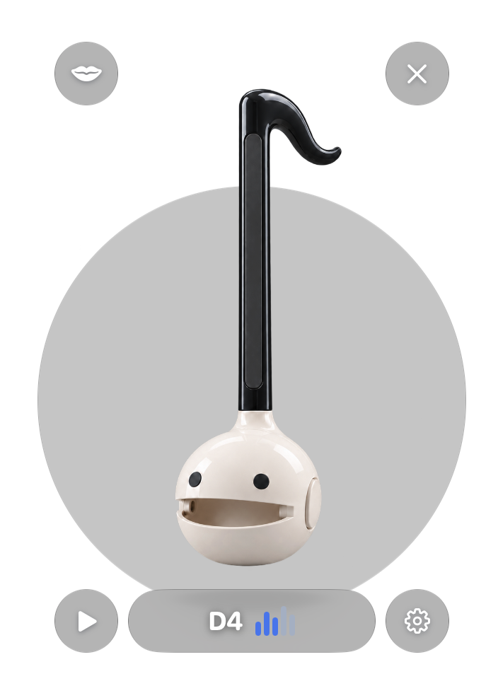

# Mactamatone

English / [한국어](README_KO.md)

<p align="center">
  
</p>

Play an Otamatone by tilting your MacBook display. Mactamatone opens as a draggable floating widget, maps the lid angle to a three-octave pitch range, and shows five mouth positions that follow the pitch.

## Install

### Homebrew

Requires an Apple Silicon Mac running macOS 14 or later.

```sh
brew install --cask yurseria/tap/mactamatone
```

The app is ad hoc signed and is not Apple notarized. As with the other apps in [Yurseria's tap](https://github.com/yurseria/homebrew-tap), the cask removes the installed app's quarantine attribute. Install it only if you trust this project and its source.

### Build from source

Install Xcode Command Line Tools, then run:

```sh
./build.sh
open dist/Mactamatone.app
```

For development, `swift run Mactamatone` also works.

## Play

1. Press the ♫ button in the widget and move the MacBook display. Pitch changes continuously over about 55°–145°.
2. The Otamatone mouth and the five bars beside the note follow the pitch in five steps. Mouth animation is always enabled. A diagonal slash over ♫ means the sound is off.
3. Open settings with the gear button to switch between lid-angle input and manual play. The **Mouth timbre** slider changes the sound's harmonics.

The app starts in English. Use the globe button in the widget or **Language** in settings to choose **English** or **한국어**. Your language selection is saved for the next launch.

Choose **Theme** in settings to switch between Classic, Pink (cherry blossom), Black (cat), Yellow (chick), Galaxy, and Shiba Inu. The widget and settings preview update immediately, including all five mouth positions. Your selection is saved for the next launch. The settings preview places each additional theme in its own decorated scene: cherry blossoms, a moonlit lounge, a sunny meadow, a galaxy, or a warm garden. These are separate background layers behind the original instrument artwork.

Drag the Otamatone to move the widget. Closing settings keeps the widget and audio running. The X button quits the app. On macOS 26 and later, the widget uses Liquid Glass.

If the lid sensor is unavailable, the app switches to manual play. The manual pitch slider lets you try the sound and mouth motion. In lid-angle mode, audio stops when the display is almost closed.

## How it works

The app reads feature report 1 from Apple's `las` HID lid-angle device on a separate queue and synthesizes audio with `AVAudioEngine`. This sensor is not exposed through a public Core Motion API, so availability can vary by Mac model or macOS version. The sensor access pattern and report format were informed by [macTilt's LidSensor.swift](https://github.com/lqSky7/iphone-duo-macos-animation/blob/main/Sources/LidSensor.swift).

The five supplied Otamatone images are stored in `Sources/Mactamatone/Resources/OtamatoneLevel0.png` through `OtamatoneLevel4.png`. The widget uses matching transparent cutouts named `OtamatoneWidgetLevel0.png` through `OtamatoneWidgetLevel4.png`. The initial design reference is in `design/Reference.png`. Additional theme cutouts are named `OtamatonePinkLevel0.png` through `OtamatoneShibaLevel4.png`. Original generated strips and their prompt notes are in `design/Themes/`; run `swift scripts/prepare-theme-art.swift` to rebuild their cutouts.

## Releases

A `vX.Y.Z` tag matching `CFBundleShortVersionString` in `Info.plist` builds an Apple Silicon DMG and publishes it to GitHub Releases. The [Homebrew tap](https://github.com/yurseria/homebrew-tap) checks stable releases and updates the cask checksum automatically.
