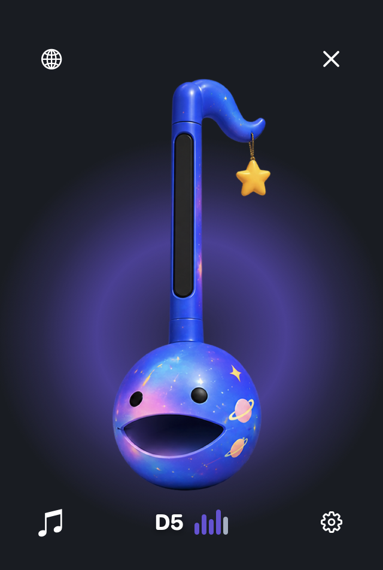
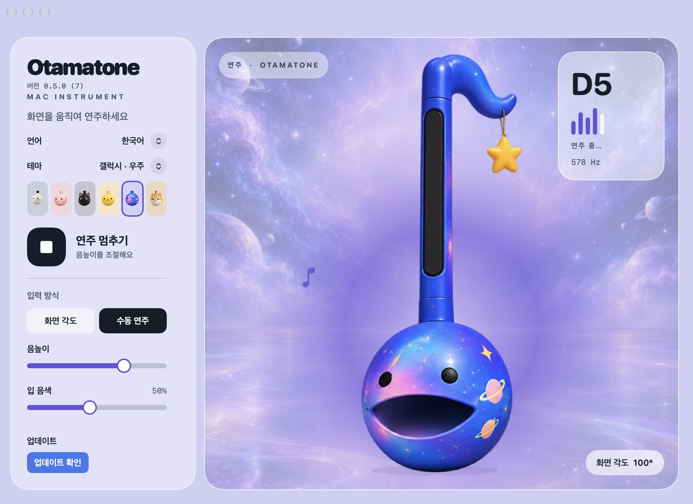

# 맥타마톤

[English](README.md) / 한국어

<p align="center">
  
</p>

맥북 화면을 기울여 연주하는 macOS 오타마톤 앱입니다. 플로팅 악기가 화면 각도에 따라 세 옥타브의 소리와 입 모양을 바꾸며, 여섯 가지 테마를 지원합니다.

## 설치

Apple Silicon 맥과 macOS 14 이상이 필요합니다.

```sh
brew install --cask yurseria/tap/mactamatone
```

[릴리스](https://github.com/yurseria/mactamatone/releases)에서 DMG를 내려받을 수도 있습니다. 소스 빌드와 자세한 설치 정보는 [개발 가이드](docs/DEVELOPMENT_KO.md)를 참고하세요.

## 위젯

<p align="center">
  
</p>

- **♫** 버튼으로 소리를 켜거나 끕니다. 대각선이 그어져 있으면 소리가 꺼진 상태입니다.
- 화면을 움직이면 **25°~130°에서 C3부터 C6까지** 음 높이가 연속으로 변합니다. 25° 미만에서는 소리가 꺼집니다.
- 입 모양과 다섯 막대가 음 높이를 따라 변합니다. 연주 중에는 테마 색상의 후광이 2초 주기로 커졌다 작아집니다.
- 악기를 드래그해 위젯을 옮길 수 있습니다. 지구본은 언어 선택, 톱니바퀴는 설정 열기, **X**는 앱 종료입니다.

설정창을 닫아도 위젯은 계속 사용할 수 있습니다. macOS 26 이상에서는 위젯 배경에 Liquid Glass를 사용합니다.

## 설정창

<p align="center">
  
</p>

- **클래식, 핑크, 블랙 고양이, 옐로우 병아리, 갤럭시, 시바견** 중에서 테마를 선택합니다. 테마마다 배경과 연주 후광이 적용됩니다.
- **화면 각도**와 **수동 연주**를 전환합니다. 화면 각도 센서가 없는 맥에서도 수동으로 연주할 수 있습니다.
- **입 음색**으로 소리의 느낌을 바꿉니다.
- 현재 버전을 확인하고 **업데이트 확인**으로 새 버전을 찾습니다. **업데이트 및 재시작**으로 설치할 수 있습니다.
- **English**와 **한국어**를 선택합니다. 기본 언어는 영어이며, 언어와 테마 선택은 다음 실행에도 유지됩니다.

스크린샷은 갤럭시 테마의 수동 연주 모습입니다. macOS의 **동작 줄이기**를 켜면 후광의 움직임이 멈춥니다.

## 문서

- [개발 가이드](docs/DEVELOPMENT_KO.md): 소스 빌드, 검증, 스크린샷 촬영과 릴리스.
- [구현 설명](docs/IMPLEMENTATION_KO.md): 화면 각도 센서, 음역 매핑, 오디오와 이미지 리소스.
