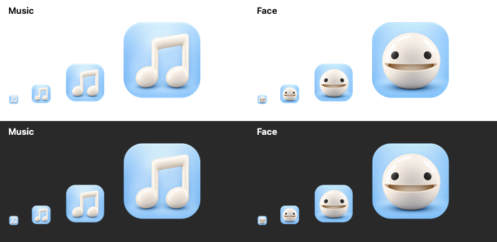

# Mactamatone app icon variants

Two variants were created with the built-in `image_gen` tool:

- **Music note (default):** `Music.png` and `Music.icns`
- **Otamatone face:** `Face.png` and `Face.icns`



Original generated images are retained as `Music-source.png` and `Face-source.png`. The existing classic Otamatone artwork guided the materials and face identity.

The packaging script normalizes the artwork to 1024px, applies a smooth rounded-tile mask to exclude alpha-matting debris outside the generated tile, and creates all standard and Retina sizes from 16 to 1024px. Source images remain unchanged.

## Regenerate

```sh
# Default music-note app icon and preview
./scripts/prepare-app-icon.sh
cp Sources/Mactamatone/Resources/AppIcon.icns design/AppIcon/Music.icns

# Alternative face icon and preview
./scripts/prepare-app-icon.sh design/AppIcon/Face-source.png design/AppIcon/Face.icns design/AppIcon/Face.png
```

To use the face icon in a local app build:

```sh
cp design/AppIcon/Face.icns Sources/Mactamatone/Resources/AppIcon.icns
./build.sh
```

`build.sh` copies the selected ICNS into the app's main resource directory. `CFBundleIconFile` references it for Finder, and the app also applies the resource at startup for Dock and source-based runs.

## Music-note prompt

```text
Use case: logo-brand
Asset type: Mactamatone macOS app icon, variant A: music-note logo.
Use the supplied icon as a reference for its pale-blue rounded-square tile, glossy ivory materials, lighting and visual polish. Preserve the tile's exact size, placement, rounded silhouette and background color.
Replace the Otamatone with one large, centered, ivory-white 3D music symbol shaped precisely like ♫: two round noteheads at the bottom, two upright stems, and ONE connecting beam at the top. It must be a clean conventional pair of beamed eighth notes, not a single note and not two beams.
The symbol should occupy about 65 percent of the tile width and height, with thick readable strokes, softly rounded edges, restrained glossy ceramic highlights, and a gentle shadow contained entirely inside the tile.
Output a single square app icon. Keep transparent pixels outside the rounded tile; absolutely no stray pixels, halos or decorative specks outside it.
No Otamatone face, no eyes, no instrument, no text, no letters, no extra symbols, no grid, no mockup. The music glyph is the only logo.
```

## Face-only prompt

```text
Use case: precise-object-edit
Asset type: Mactamatone macOS app icon, variant B: Otamatone face only.
Edit the supplied icon. Preserve the pale-blue rounded-square tile's exact size, placement, rounded silhouette and background color.
Show ONLY the classic Otamatone's warm-white spherical face, two round black eyes, and slightly open smiling mouth. Remove the entire black stem, curled music-note tip and white neck; the face should be a complete round sphere with a smooth uninterrupted top.
Center the face within the tile and enlarge it to occupy about 72 percent of the tile width. Keep the face identity, cute expression, glossy ceramic materials and soft studio lighting. The face alone is the logo.
Keep a gentle grounding shadow entirely inside the tile. Output one square icon with true empty transparency outside the tile and no stray pixels or specks.
No stem, no note, no neck, no musical symbols, no text, no lettering, no other objects, no grid, no mockup.
```
