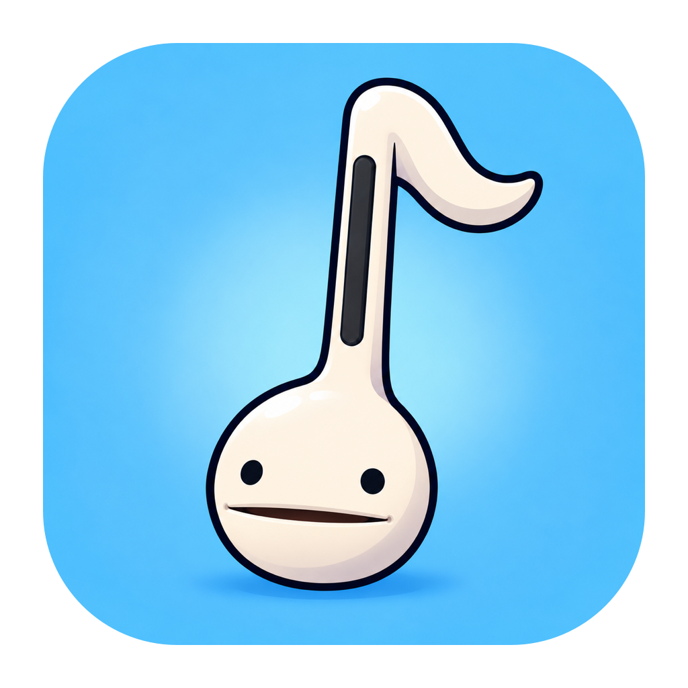

# Mactamatone app icons

The default app icon is the user-provided Otamatone illustration on a blue background:



- `Otamatone-source.png`: unchanged supplied artwork.
- `Otamatone.png`: 1024px app-icon preview with a transparent margin and rounded tile.
- `Otamatone.icns`: all standard and Retina sizes, from 16 to 1024px.

The complete source image is fitted inside the tile so the instrument is preserved. `build.sh` packages `Sources/Mactamatone/Resources/AppIcon.icns` for Finder, and the app applies it at startup for Dock and source-based runs.

## Regenerate

```sh
# Default app icon and preview
./scripts/prepare-app-icon.sh
cp Sources/Mactamatone/Resources/AppIcon.icns design/AppIcon/Otamatone.icns
```

## Previous alternatives

The earlier music-note and face-only variants are retained as `Music.png` / `Music.icns` and `Face.png` / `Face.icns`. Their original generated artwork is in `Music-source.png` and `Face-source.png`.


These variants were created with the built-in `image_gen` tool. Their `generated` layout masks out stray pixels beyond the existing tile:

```sh
./scripts/prepare-app-icon.sh design/AppIcon/Music-source.png design/AppIcon/Music.icns design/AppIcon/Music.png generated
./scripts/prepare-app-icon.sh design/AppIcon/Face-source.png design/AppIcon/Face.icns design/AppIcon/Face.png generated
```

To use an alternative locally, copy its ICNS to `Sources/Mactamatone/Resources/AppIcon.icns` and run `./build.sh`.

## Music-note prompt

```text
Use case: logo-brand
Asset type: Mactamatone macOS app icon, variant A: music-note logo.
Use the supplied icon as a reference for its pale-blue rounded-square tile, glossy ivory materials, lighting and visual polish. Preserve the tile's exact size, placement, rounded silhouette and background color.
Replace the Otamatone with one large, centered, ivory-white 3D music symbol shaped precisely like ♫: two round noteheads at the bottom, two upright stems, and ONE connecting beam at the top. It must be a clean conventional pair of beamed eighth notes, not a single note and not two beams.
The symbol should occupy about 65 percent of the tile width and height, with thick readable strokes, softly rounded edges, restrained glossy ceramic highlights, and a gentle shadow contained entirely inside the tile.
Output a single square app icon. Keep transparent pixels outside the rounded tile; absolutely no stray pixels, halos or decorative specks outside it.
No Otamatone face, no eyes, no instrument, no text, no letters, no extra symbols, no grid, no mockup. The music glyph is the only logo.
```

## Face-only prompt

```text
Use case: precise-object-edit
Asset type: Mactamatone macOS app icon, variant B: Otamatone face only.
Edit the supplied icon. Preserve the pale-blue rounded-square tile's exact size, placement, rounded silhouette and background color.
Show ONLY the classic Otamatone's warm-white spherical face, two round black eyes, and slightly open smiling mouth. Remove the entire black stem, curled music-note tip and white neck; the face should be a complete round sphere with a smooth uninterrupted top.
Center the face within the tile and enlarge it to occupy about 72 percent of the tile width. Keep the face identity, cute expression, glossy ceramic materials and soft studio lighting. The face alone is the logo.
Keep a gentle grounding shadow entirely inside the tile. Output one square icon with true empty transparency outside the tile and no stray pixels or specks.
No stem, no note, no neck, no musical symbols, no text, no lettering, no other objects, no grid, no mockup.
```
